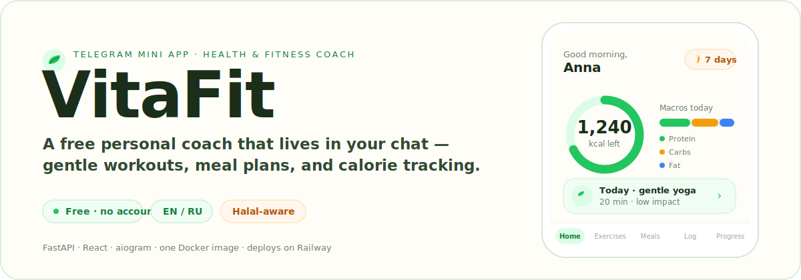
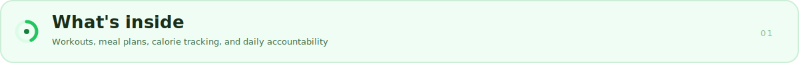
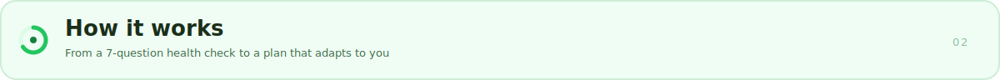
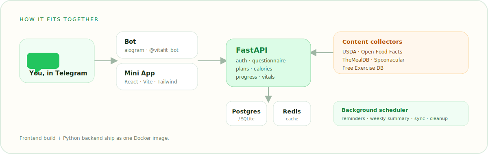
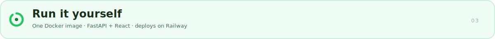

<p align="center">
  
</p>

<p align="center">
  
  
  
  
  
</p>

**VitaFit** is a free personal health and fitness coach that runs entirely inside Telegram. Open the bot, answer a short health check, and get a personalized plan of gentle workouts, diet-aware meal ideas, and calorie tracking — no separate app to install and no account to create.

It is built to be used by real people who are not gym regulars: warm tone, large tap targets, plain language, and full English / Russian support.

---

<p align="center">
  
</p>

- **Gentle, personalized workouts** — 193 built-in exercises across yoga (50), stretching (35), bodyweight (54), pilates (30), and tai chi (24), each with images and form tips. Plans are generated from your health check and skew low-impact by default.
- **Diet-aware meal plans** — 60 seed recipes with images and ingredients, honoring Halal, Vegetarian, Vegan, Gluten-free, and Dairy-free preferences.
- **Calorie & macro tracking** — search a database of 530+ foods (global + Russian), add custom foods, and watch a daily calorie ring and protein / carbs / fat breakdown.
- **Health-check vitals** — log weight, waist, body-fat, blood pressure, and resting heart rate, and see progress over time.
- **Accountability that nudges** — streaks, morning / evening reminders, and a weekly summary delivered right in the chat.
- **Bilingual by design** — every screen and bot message is available in English and Russian.

---

<p align="center">
  
</p>

1. **Open the bot** — `/start` in Telegram. You are authenticated through Telegram itself; there is no signup form.
2. **Take the health check** — a 7-question PAR-Q screening plus your goals, diet, and activity level.
3. **Get your plan** — the exercise planner and meal planner build a personalized week from your answers.
4. **Track and adjust** — log meals, water, workouts, and vitals; the plan and reminders adapt as you go.

<p align="center">
  
</p>

Both the **bot** (aiogram) and the **Mini App** (React + Vite + Tailwind) are served by a single **FastAPI** backend. The frontend build and the Python backend ship together as **one Docker image**. Content collectors (USDA, Open Food Facts, TheMealDB, Spoonacular, Free Exercise DB) keep the food and exercise libraries fresh, and a background scheduler handles reminders, weekly summaries, nightly sync, and cleanup.

---

<p align="center">
  
</p>

### Quick start with Docker

```bash
git clone https://github.com/xidik12/vitafit.git
cd vitafit

# Provide a bot token (from @BotFather) and a JWT secret
export TELEGRAM_BOT_TOKEN=123456:your-token-here
export JWT_SECRET_KEY=$(openssl rand -hex 32)

docker compose up --build
```

The app serves the Mini App and API on `http://localhost:8000`. Point your Telegram bot's Web App URL at that host (a tunnel such as ngrok works for local testing).

### Configuration

Copy `backend/.env.example` and fill in what you need:

| Variable | Required | Purpose |
| --- | --- | --- |
| `TELEGRAM_BOT_TOKEN` | yes | Bot token from @BotFather; without it the bot stays disabled |
| `JWT_SECRET_KEY` | yes | Signs Mini App session tokens |
| `DATABASE_URL` | no | Defaults to SQLite; set a Postgres URL for production |
| `REDIS_URL` | no | Cache and rate-limit store |
| `TELEGRAM_WEBAPP_URL` | no | Public Mini App URL (auto-detected on Railway) |
| `SPOONACULAR_API_KEY` / `USDA_API_KEY` / `PEXELS_API_KEY` | no | Enrich recipes, foods, and images from external sources |

### Deploy

The repo ships a `Dockerfile` and `railway.json`, so a Railway (or any Docker host, including Coolify) deploy needs only the environment variables above. Railway's public domain is detected automatically for the Mini App URL.

### Bot commands

| Command | What it does |
| --- | --- |
| `/start` | Start the bot and open the Mini App |
| `/help` | Show help |
| `/plan` | View your current plan |
| `/streak` | Check your streak |
| `/water 250` | Log water in millilitres |
| `/settings` | Change language |

---

## Project layout

```text
vitafit/
├── backend/          FastAPI app — API, Telegram bot, scheduler, data collectors
│   └── app/
│       ├── api/        auth, questionnaire, exercises, recipes, calories, progress …
│       ├── bot/        aiogram bot, commands, reminders, i18n
│       ├── services/   exercise + meal planners, nutrition, accountability
│       ├── collectors/ USDA, Open Food Facts, TheMealDB, Spoonacular, Exercise DB
│       └── data/       seed foods, recipes, yoga / tai chi / pilates / stretching
└── webapp/           React + Vite + Tailwind Mini App (EN / RU)
```

## A note on scope

VitaFit is for informational and educational use only. Its exercise plans, meal ideas, and nutrition figures are **not medical advice** — consult a qualified healthcare professional before starting any new fitness or nutrition program, especially with an existing condition. This is why the health check runs a PAR-Q screening before generating a plan.
